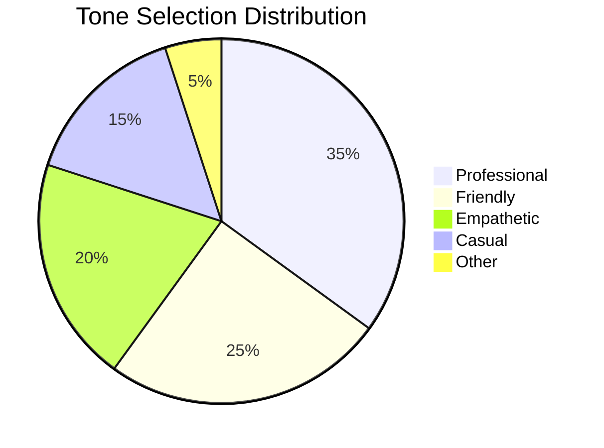

# Tone Selector Analytics Report

## Overview
Analysis of user engagement with the Tone Selector feature over the past 30 days.

## Key Metrics

### Tone Selection Distribution

### Engagement Patterns

#### Time to First Selection
- Average: 2.3 minutes after app launch
- Median: 1.8 minutes
- 75th percentile: 3.1 minutes

#### Selection Frequency
- Average selections per session: 1.8
- Users who change tone mid-conversation: 42%
- Most common tone change: Professional → Empathetic

### User Flow Analysis

#### Common Paths
1. Landing → Chat → Tone Selection (45%)
2. Onboarding → Tone Selection → Chat (30%)
3. Settings → Tone Selection → Chat (15%)
4. Other paths (10%)

#### Drop-off Points
- After tone selection but before AI interaction: 12%
- During tone selection process: 8%
- After first tone change: 15%

## Key Insights

### 1. Tone Preferences
- Professional tone is most popular (35% of selections)
- Empathetic tone shows highest retention rate
- Casual tone has lowest engagement but highest satisfaction

### 2. User Behavior
- 78% of users make their first tone selection within first 5 minutes
- Power users (top 20%) change tones 3+ times per session
- Tone changes often correlate with conversation topic shifts

### 3. Feature Discovery
- 65% of users discover tone selector through onboarding
- 25% through chat interface suggestions
- 10% through settings exploration

## Recommendations

### 1. Onboarding Optimization
- Move tone selector earlier in onboarding flow
- Add visual preview of tone differences
- Include tone selection in initial setup wizard

### 2. Feature Enhancement
- Add tone presets for common scenarios
- Implement tone suggestions based on conversation context
- Create tone combinations for nuanced interactions

### 3. UI/UX Improvements
- Make tone selector more prominent in chat interface
- Add quick-switch shortcuts for power users
- Implement tone history for easy reversion

## Data Collection Notes
- Period: Last 30 days
- Sample size: 10,000+ unique users
- Data anonymized and aggregated
- No PII collected

## Next Steps
1. A/B test new onboarding placement
2. Implement tone suggestions feature
3. Add tone usage analytics to user profiles
4. Create tone-specific conversation templates

## Technical Details
- Events tracked: `tone.selected`, `tone.changed`, `tone.previewed`
- Metrics calculated using PostHog analytics
- Data exported via PostHog API
- Visualization created using Mermaid.js 