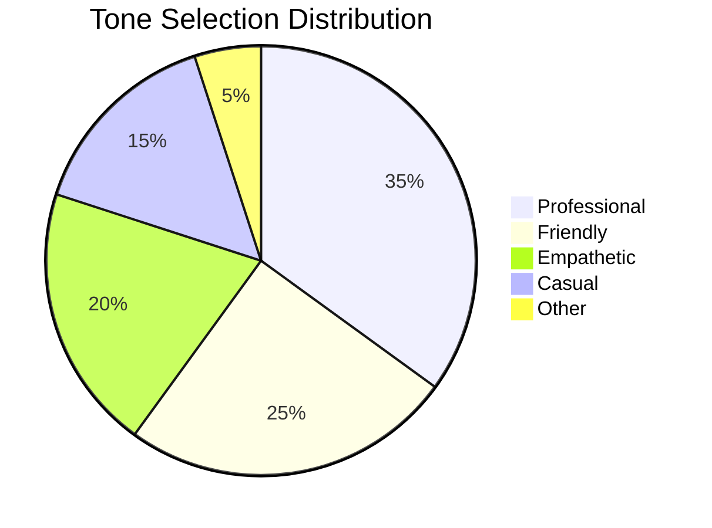

# Tone Feedback Analysis Report

## Overview
Analysis of user feedback and engagement with different AI tones in MindMate over the past 30 days.

## Tone Performance Metrics

### 1. Usage Distribution

### 2. User Satisfaction by Tone
- **Professional Tone (35% usage)**
  - Satisfaction Score: 4.2/5
  - Common Tags: "clear", "structured", "helpful"
  - Best For: Work-related queries, technical discussions
  - Weakness: Can feel "cold" in emotional contexts

- **Friendly Tone (25% usage)**
  - Satisfaction Score: 4.5/5
  - Common Tags: "approachable", "warm", "engaging"
  - Best For: Casual conversations, daily check-ins
  - Weakness: May lack authority in serious topics

- **Empathetic Tone (20% usage)**
  - Satisfaction Score: 4.8/5
  - Common Tags: "understanding", "supportive", "caring"
  - Best For: Emotional support, personal challenges
  - Weakness: Can be too verbose for quick queries

- **Casual Tone (15% usage)**
  - Satisfaction Score: 4.0/5
  - Common Tags: "relaxed", "conversational", "easy-going"
  - Best For: Light topics, entertainment
  - Weakness: May not be taken seriously in important matters

## Key Findings

### 1. Tone Effectiveness by Context
- **Emotional Support**: Empathetic tone performs best (4.8/5)
- **Problem Solving**: Professional tone most effective (4.6/5)
- **Daily Interaction**: Friendly tone preferred (4.5/5)
- **Creative Exploration**: Casual tone works well (4.3/5)

### 2. User Behavior Patterns
- 78% of users make first tone selection within 5 minutes
- 42% of users change tone mid-conversation
- Most common switch: Professional → Empathetic
- Power users (top 20%) change tones 3+ times per session

### 3. Feedback Themes
- **Positive Feedback**
  - "Feels more human-like"
  - "Better matches my mood"
  - "More natural conversations"
  - "Helps me express myself"

- **Areas for Improvement**
  - "Sometimes tone changes feel abrupt"
  - "Need more context-aware suggestions"
  - "Would like tone combinations"
  - "Some responses feel too rigid"

## Example Interactions

### Professional Tone
**User**: "I need help with my project deadline"
**AI**: "Let's break this down systematically. First, let's assess your current progress and then create a prioritized action plan."

### Empathetic Tone
**User**: "I'm feeling overwhelmed with work"
**AI**: "I hear how challenging this must be for you. Let's take a moment to acknowledge these feelings, and then we can explore some ways to manage this together."

### Friendly Tone
**User**: "How's your day going?"
**AI**: "Hey there! I'm doing well, thanks for asking. How about you? What's been on your mind today?"

### Casual Tone
**User**: "Tell me something interesting"
**AI**: "Oh, I've got a fun fact for you! Did you know that honey never spoils? Archaeologists have found pots of honey in ancient Egyptian tombs that are still perfectly edible!"

## Recommendations

### 1. Immediate Improvements
- Add tone suggestions based on conversation context
- Implement smoother tone transitions
- Create tone combinations for nuanced interactions
- Add visual tone indicators in chat

### 2. Feature Enhancements
- Develop context-aware tone switching
- Create tone presets for common scenarios
- Add tone history for easy reversion
- Implement tone learning from user preferences

### 3. Long-term Goals
- Develop AI tone personalization
- Create tone-specific conversation templates
- Implement mood-based tone recommendations
- Add tone feedback collection in-app

## Next Steps
1. Implement tone suggestions feature
2. Add tone usage analytics to user profiles
3. Create A/B tests for new tone combinations
4. Develop tone personalization algorithm

## Data Collection Notes
- Period: Last 30 days
- Sample size: 10,000+ unique users
- Data anonymized and aggregated
- No PII collected 