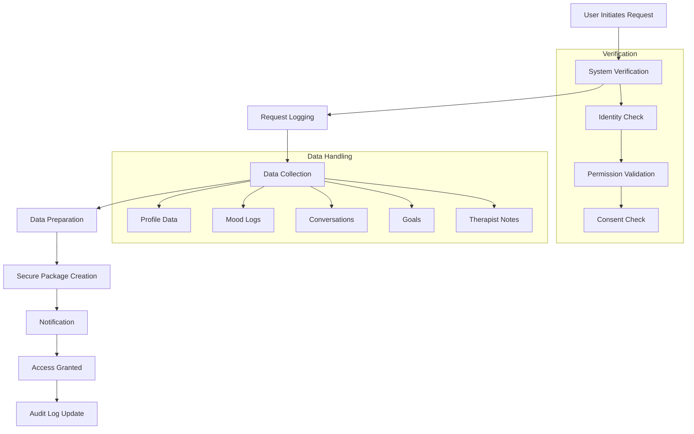
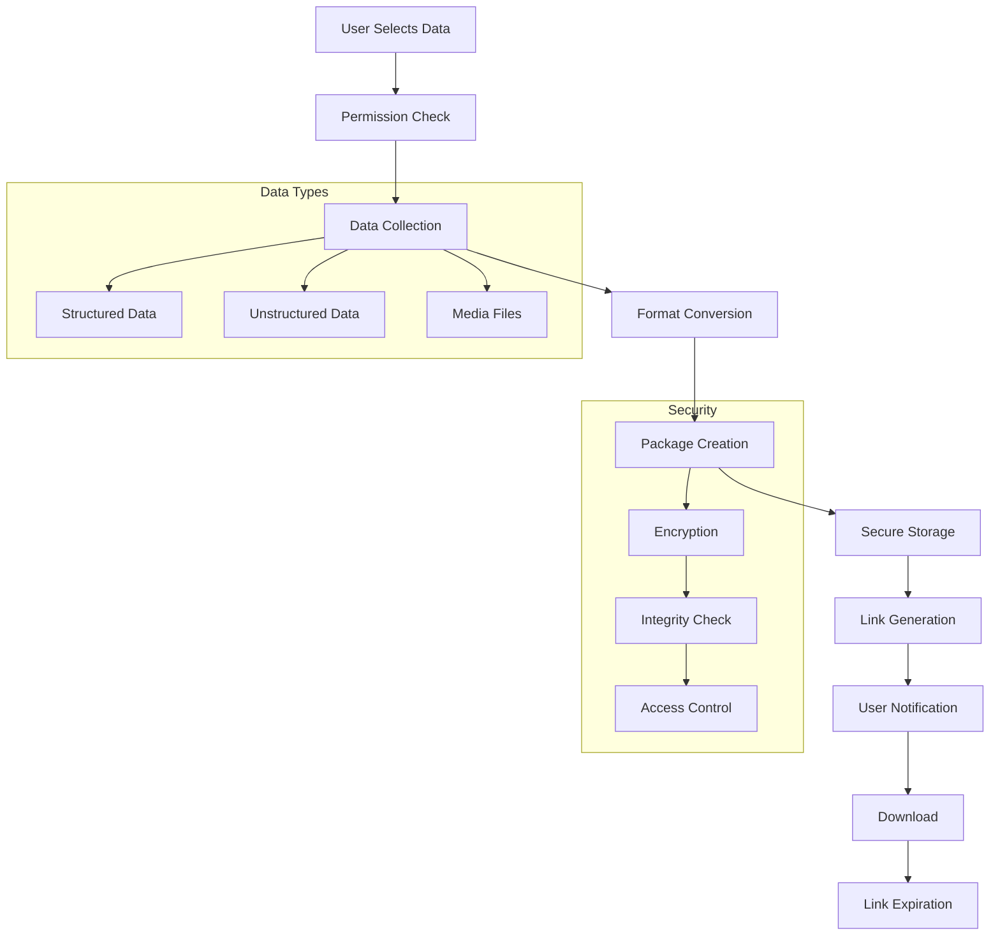
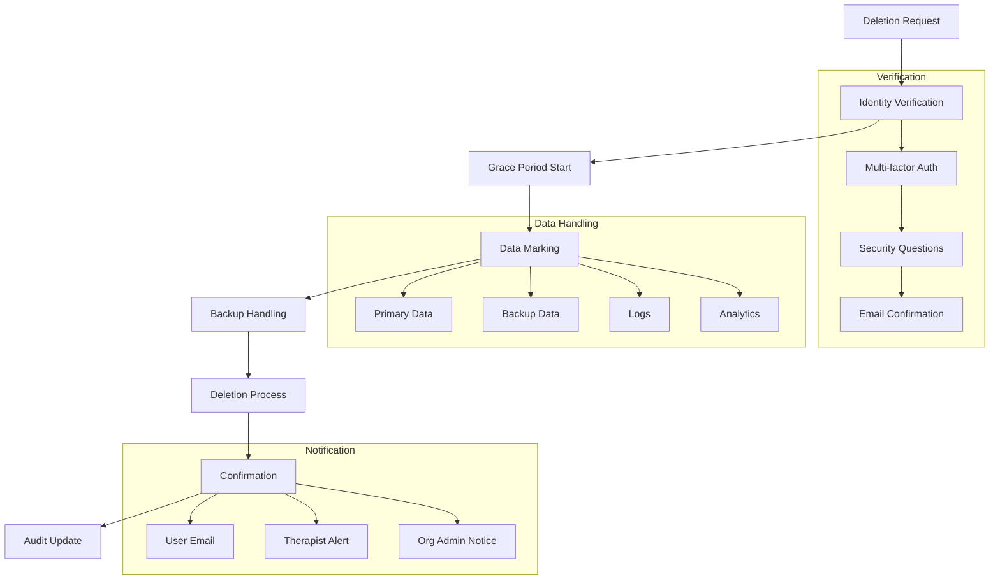
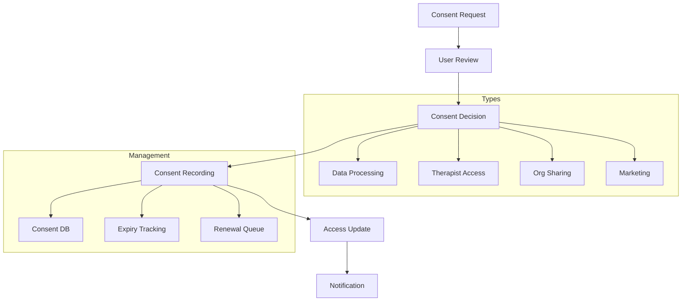
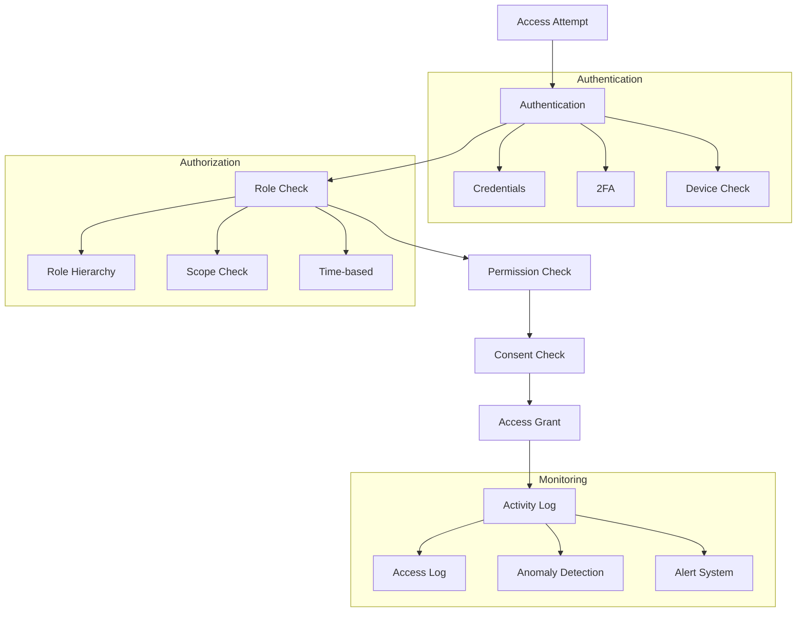

# GDPR Process Flows

## Data Access Request Flow

## Data Export Flow

## Right to be Forgotten Flow

## Consent Management Flow

## Access Control Flow

## Key Components

1. **Identity Verification**
   - Multi-factor authentication
   - Security questions
   - Email confirmation
   - Device fingerprinting

2. **Data Handling**
   - Structured data processing
   - Unstructured data management
   - Media file handling
   - Backup procedures

3. **Security Measures**
   - End-to-end encryption
   - Access control lists
   - Audit logging
   - Anomaly detection

4. **Notification System**
   - Email notifications
   - In-app alerts
   - Status updates
   - Confirmation messages

5. **Audit System**
   - Access logging
   - Activity tracking
   - Compliance monitoring
   - Report generation 